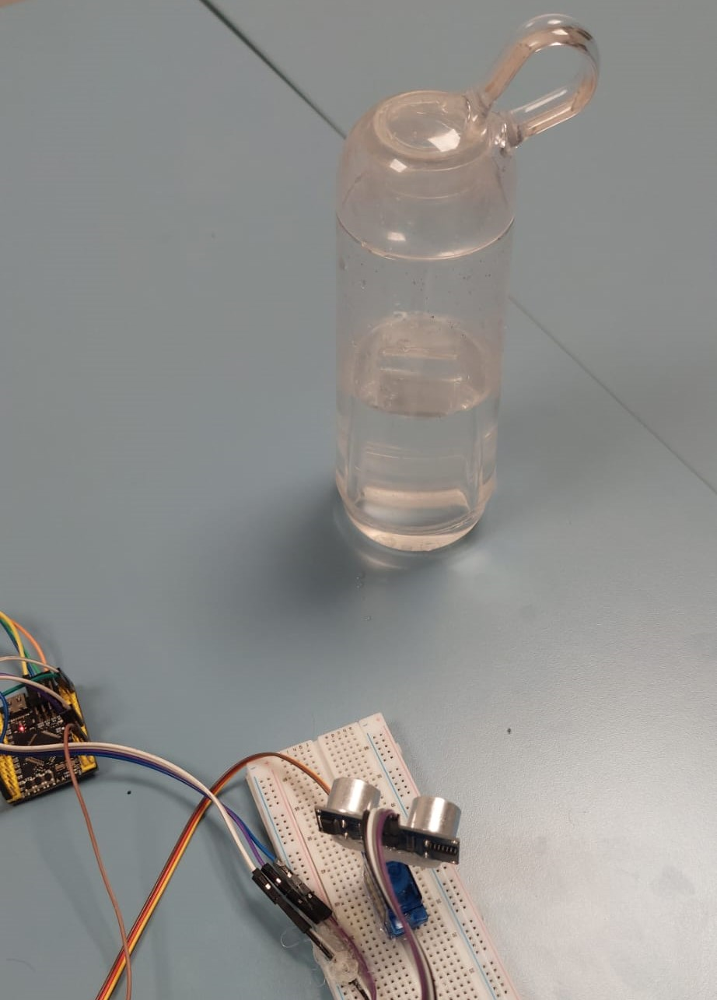
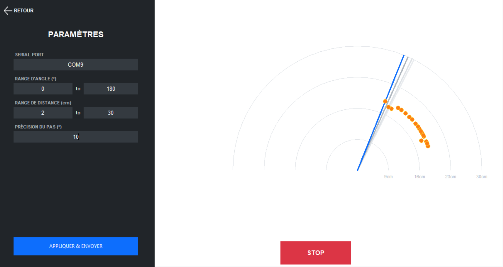
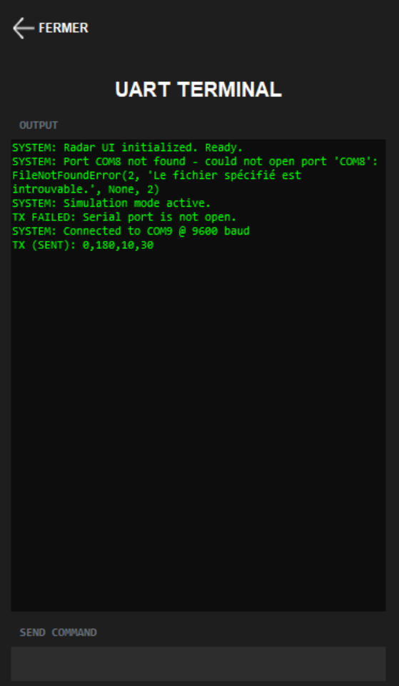

# STM32 Ultrasonic Scanner

Embedded system built on STM32 that drives a servo-mounted HC-SR04 ultrasonic sensor to produce a 180-degree distance map, transmitted in real time over UART to a radar-style desktop interface.

---

## Overview

The system sweeps a servo motor from a configurable left angle to a right angle in discrete steps. At each position, the HC-SR04 sensor takes three distance measurements; the median value is selected and sent via UART. A Python desktop application renders the data as a polar radar display and allows runtime reconfiguration of the scan parameters.

---

## Hardware

- STM32F4 microcontroller
- HC-SR04 ultrasonic sensor
- SG90 servo motor (PWM control)
- UART serial link at 115200 baud

---

## Gallery

Hardware setup — STM32 board connected to the HC-SR04 sensor on a breadboard, aimed at a target object:



Radar display — full 180-degree sweep with obstacle in range and Configuration Panel in the left side:



Radar display — UART visualisation Panel :




---

## Project Structure

```
.
├── Core/
│   ├── main.c
│   ├── HCSR04.c / HCSR04.h
│   ├── UltrasonicScanner.c / UltrasonicScanner.h
│   └── Helpers.c / Helpers.h
├── UI/
│   └── radar_ui.py
└── assets/
    ├── hardware.jpg
    ├── radar_sweep.png
    ├── radar_object.png
    └── settings.png
```

---

## Key Modules

### HC-SR04 Driver — `HCSR04.c`

Handles the low-level timing of the ultrasonic sensor. A 10 µs trigger pulse is generated, then the echo pulse duration is measured using a hardware timer running at 1 MHz (prescaler 99 on a 100 MHz clock). Distance is derived from the formula:

```
distance (cm) = duration (µs) / 58
```

Timeout protection is applied at both the echo-rising-edge wait and the echo-falling-edge wait to avoid infinite blocking.

```c
HCSR04_State get_Distance(HCSR04_HandleTypeDef* hcsr04, float *distance)
{
    // Trigger pulse
    HAL_GPIO_WritePin(hcsr04->trig_port, hcsr04->trig_pin, GPIO_PIN_SET);
    while (__HAL_TIM_GET_COUNTER(hcsr04->htim) < 10);
    HAL_GPIO_WritePin(hcsr04->trig_port, hcsr04->trig_pin, GPIO_PIN_RESET);

    // Wait for echo rising edge with timeout
    pMillis = __HAL_TIM_GET_COUNTER(hcsr04->htim);
    while (!(HAL_GPIO_ReadPin(hcsr04->echo_port, hcsr04->echo_pin))) {
        if ((__HAL_TIM_GET_COUNTER(hcsr04->htim) - pMillis) > 30000)
            return HCSR04_TIMEOUT;
    }

    // Measure echo duration
    __HAL_TIM_SET_COUNTER(hcsr04->htim, 0);
    while (HAL_GPIO_ReadPin(hcsr04->echo_port, hcsr04->echo_pin)) {
        if ((__HAL_TIM_GET_COUNTER(hcsr04->htim) - pMillis) > hcsr04->max_distance)
            return HCSR04_TIMEOUT;
    }

    *distance = (float)__HAL_TIM_GET_COUNTER(hcsr04->htim) / 58.0f;
    return HCSR04_OK;
}
```

---

### Servo & Angle Conversion — `Helpers.c`

The servo is driven by TIM2 in PWM mode with a 20 ms period (50 Hz). Pulse width maps linearly from 1000 µs (0°) to 2000 µs (180°).

```c
uint16_t AngletoTime(uint8_t angle) {
    if (angle > 180) angle = 180;
    return (uint16_t)((angle * 1000.0f / 180.0f) + 1000);
}

uint8_t TimetoAngle(uint16_t time) {
    return (time - 1000) * 180.0f / 1000.0f;
}
```

UART data is serialized as `angle,distance\r\n`:

```c
void send_data(UART_HandleTypeDef* huart, uint16_t angle, uint16_t distance) {
    char msg[20];
    sprintf(msg, "%d,%d\r\n", angle, (int)distance);
    HAL_UART_Transmit(huart, (uint8_t*)msg, strlen(msg), 100);
}
```

---

### Scanner Logic — `UltrasonicScanner.c`

The scanner performs a bidirectional sweep. At each step, three measurements are collected and sorted; the median (index 1) is transmitted. This reduces the impact of spurious readings.

```c
for (size_t i = 0; i < 3; i++)
    get_Distance(hus->hcsr04, &distances[i]);

// Bubble sort — pick median
for (size_t i = 0; i < 3; i++)
    for (size_t j = i + 1; j < 3; j++)
        if (distances[i] > distances[j]) {
            float temp = distances[i];
            distances[i] = distances[j];
            distances[j] = temp;
        }

send_data(hus->uart_comm, current_angle, distances[1]);
```

---

### Runtime Configuration via UART

The desktop interface sends a configuration string that the STM32 parses on the fly. Incoming data is buffered in the UART interrupt, and the main loop applies the new parameters between scan passes.

UART command format:

```
left_angle,right_angle,step,max_distance
```

Example:

```
0,180,10,30
```

Parsing:

```c
void UScanner_UpdateConfigFromUART(char* buffer, System_config* config) {
    int left, right, step, max_distance;
    if (sscanf(buffer, "%d,%d,%d,%d", &left, &right, &step, &max_distance) == 4) {
        config->max_left_angle  = (uint8_t)left;
        config->max_right_angle = (uint8_t)right;
        config->rotation_step   = (uint8_t)step;
        config->max_distance    = (uint16_t)max_distance;
    }
}
```

---

## Timer Configuration

| Timer | Role | Prescaler | Period | Tick |
|-------|------|-----------|--------|------|
| TIM1  | HC-SR04 timing | 99 | 65535 | 1 µs |
| TIM2  | Servo PWM | 99 | 19999 | 20 ms |

Clock source: HSE 8 MHz, PLL to 100 MHz system clock.

---

## System State Machine

```
US_SYSTEM_READY  -->  UScanner_System_Start()  (scan loop)
        ^                        |
        |              UART received
        |                        v
        +--------  US_SYSTEM_CONFIG  -->  UScanner_UpdateConfigFromUART()
                                          UScanner_System_Update()
```

---

## Desktop UI

The companion interface connects to the STM32 over serial, renders incoming `angle,distance` pairs as a polar radar plot, and sends configuration commands on demand.

Configurable parameters from the UI:

- Angle range (left / right bound)
- Distance range (min / max in cm)
- Step precision (degrees)
- Serial port (COM port selection)

---

## Default Configuration

```c
sys_config.max_distance    = 30;   // cm
sys_config.max_right_angle = 180;  // degrees
sys_config.rotation_step   = 10;   // degrees
```
